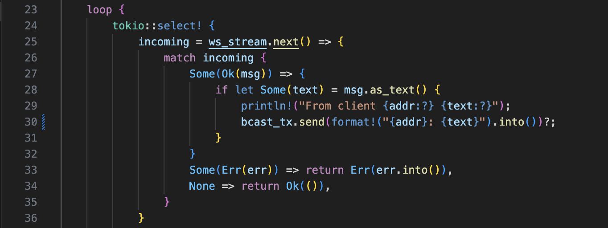

# Tutorial 10
Fikri Risyad Indratno 
2206031170 
Advanced Programming B 

---

## Reflection

### Original code

How to run:
- For server, run `cargo run --bin server`
- For client, run `cargo run --bin client`

First, we run a server and three clients that will connect to the same port as the server. The server will print a message if a client has successfully connected. When we enter a message in the client's terminal, the message will be sent to the server and the server will broadcast it to all clients that are connected.

### Modify port

Modify the port to be 8080 in the client.

Modify the port to be 8080 in the server.

The programs run properly.

### Small changes

I've made changes that make the server's broadcast send the client's IP and port in addition to the text messages.

